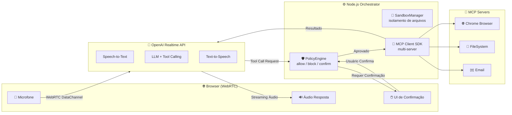

# 🔐 Realtime MCP Agent

> Um agente de automação por voz com **governança humana**. A IA ouve, planeja e propõe ações — mas **nunca executa** ferramentas sensíveis sem sua aprovação explícita, rodando dentro de um **sandbox isolado** via protocolo MCP.

---

## 🎯 O que faz

Fale com a IA pelo navegador. Ela entende seus comandos, acessa ferramentas (navegador, e-mail, sistema de arquivos) e, quando uma ação é considerada de alto risco, **interrompe o fluxo e pede sua confirmação** antes de prosseguir.

```
Você: "Envie um e-mail para o João e depois tire um screenshot do site"
IA: "Entendi. Para enviar o e-mail, preciso da sua confirmação."
[Sistema exibe diálogo de aprovação]
Você: [Confirma]
IA: [Executa e-mail] → "Feito. Agora tirando o screenshot..." [Executa screenshot]
```

---

## 🏗️ Arquitetura



---

## 🛡️ Segurança por Design

| Camada | Implementação | O que protege |
|--------|---------------|---------------|
| **Policy Engine** | Regras `allow` / `block` / `confirm` por ferramenta | Ações não-autorizadas são interceptadas antes de executar |
| **Confirmação Humana** | Loop assíncrono via HTTP + UI de alerta no navegador | O usuário tem a última palavra em ações de alto risco |
| **Sandbox Manager** | Validação de caminho com `path.resolve` + prefixo | Ataques de path traversal (ex: `../../etc/passwd`) são bloqueados |
| **MCP SDK Oficial** | Protocolo JSON-RPC tipado via `@modelcontextprotocol/sdk` | Comunicação robusta e extensível com servidores MCP |

---

## 🚀 Como Rodar

### 1. Clone e instale
```bash
cd MCP/mcp-realtime
npm install
```

### 2. Configure o ambiente
```bash
cp .env.example .env
# Edite .env e insira sua OPENAI_API_KEY
```

### 3. Configure os MCP Servers
Edite `mcp-config.json` para apontar para seus servidores MCP (Chrome, Filesystem, etc.).

### 4. Inicie o servidor
```bash
npm run dev
```

O servidor sobe em `http://localhost:3000`.

### 5. Abra o cliente
Abra `MCP/realtime-client/realtime-webrtc.html` no navegador (recomenda-se HTTPS para microfone).

---

## 📡 Endpoints da API

| Rota | Método | Descrição |
|------|--------|-----------|
| `/mcp/run` | `POST` | Executa um prompt completo (LLM + tools + segurança) |
| `/mcp/execute` | `POST` | Executa uma única tool com validação de política |
| `/mcp/confirm` | `POST` | Confirma uma tool que estava pendente de aprovação |
| `/mcp` | `GET` | Transporte SSE para clientes MCP nativos |

---

## 🧰 Stack Tecnológica

- **Backend**: Node.js + TypeScript + Express
- **Segurança**: Policy Engine customizado + Sandbox Manager
- **IA**: OpenAI Realtime API (WebRTC + Tool Calling)
- **Protocolo**: MCP (Model Context Protocol) via SDK oficial
- **Frontend**: Vanilla JS + WebRTC (navegador)

---

## 📄 Licença

Projeto pessoal de estudo e prototipagem. Uso livre para referência.
