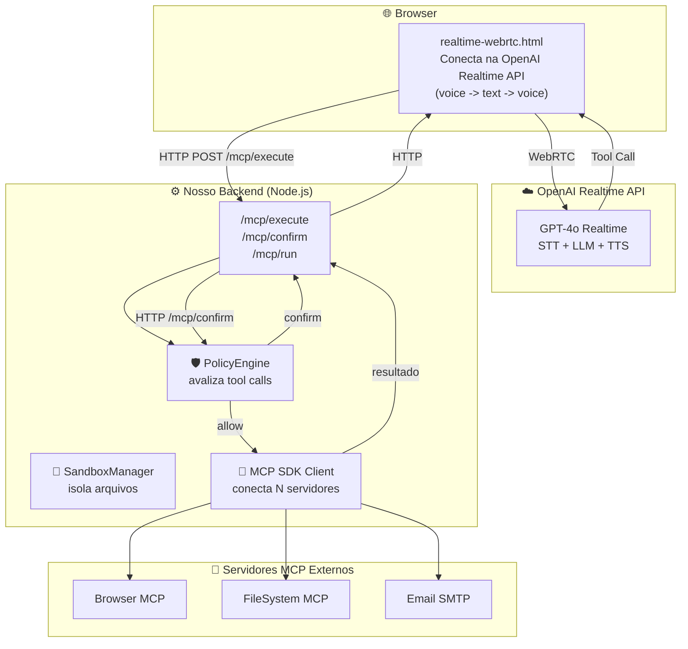

# 🔐 Realtime MCP Agent

> Protótipo de orquestrador seguro para automação via IA. Intercepta chamadas de ferramentas (MCP), aplica regras de segurança (`allow`/`block`/`confirm`) e exige aprovação humana antes de executar ações de alto risco.

---

## 🎯 O que faz (de verdade)

Este é um **backend de segurança** que funciona entre a IA e as ferramentas do sistema.

- Recebe requisições de execução de ferramentas (via HTTP ou MCP)
- Avalia cada tool contra o `PolicyEngine` — `allow`, `block` ou `confirm`
- Se a tool exigir confirmação, **interrompe** e devolve status `requires_confirmation`
- Só executa se o usuário confirmar explicitamente (via endpoint `/mcp/confirm`)
- O `SandboxManager` garante que operações de arquivo fiquem dentro de uma pasta isolada

**O que NÃO faz ainda:**
- ❌ Não há pipeline de voz end-to-end (STT/LLM/TTS) rodando localmente
- ❌ O WebRTC no frontend conecta diretamente na OpenAI — nosso backend não processa áudio
- ❌ A confirmação de segurança no frontend usa `alert()` nativo (funcional, mas não é UI polida)
- ❌ Requer servidores MCP externos configurados manualmente no `mcp-config.json` para ter tools

---

## 🏗️ Arquitetura Real



**Fluxo real:**
1. Usuário fala com a IA via OpenAI Realtime (WebRTC)
2. IA decide chamar uma ferramenta → envia comando pro frontend
3. Frontend faz **HTTP POST para nosso backend** (`/mcp/execute`)
4. Nosso backend (`PolicyEngine`) decide: executa, bloqueia, ou pede confirmação
5. Se for `confirm`, frontend mostra `alert()` — usuário clica OK ou Cancela
6. Se confirmado, backend chama o servidor MCP real (Chrome, Filesystem, etc.)
7. Resultado volta pro frontend, que envia de volta pra OpenAI via WebRTC

---

## 🛡️ Segurança por Design

| Camada | Implementação | O que protege |
|--------|---------------|---------------|
| **Policy Engine** | `PolicyEngine.ts` — regras `allow`/`block`/`confirm` por nome de tool | Intercepta tool calls antes da execução |
| **Confirmação Humana** | `AgentOrchestrator` armazena call pendente + endpoint `/mcp/confirm` | Usuário tem veto final em ações de alto risco |
| **Sandbox Manager** | `SandboxManager.ts` — `path.resolve` + validação de prefixo | Impede path traversal (`../../etc/passwd`) |
| **MCP SDK Oficial** | `@modelcontextprotocol/sdk` — `Client` + `StdioClientTransport` | Conecta servidores MCP reais (não mocks) |

---

## 🚀 Como Rodar

### 1. Instale dependências
```bash
cd MCP/mcp-realtime
npm install
```

### 2. Configure o ambiente
```bash
cp .env.example .env
# Edite .env:
#   OPENAI_API_KEY=sk-... (obrigatório)
#   MCP_AUTH=Bearer ... (opcional, protege endpoints)
```

### 3. Configure servidores MCP
Edite `mcp-config.json`. Exemplo:
```json
{
  "mcpServers": [
    {
      "id": "chrome",
      "command": "node",
      "args": ["../mcp-chrome-stdio.js"],
      "enabled": true
    }
  ]
}
```

**Sem servidores MCP configurados, o sistema não terá ferramentas para chamar.**

### 4. Inicie o servidor
```bash
npm run dev
```

### 5. Abra o cliente
Abra `MCP/realtime-client/realtime-webrtc.html` em um navegador.

**Importante:** O microfone só funciona em contexto seguro (HTTPS ou `localhost`). Para HTTPS local, gere certificados com `mkcert`.

---

## 📡 Endpoints

| Rota | Método | Descrição |
|------|--------|-----------|
| `POST /mcp/run` | Prompt completo (chama LLM + tools) | Requer `OPENAI_API_KEY` |
| `POST /mcp/execute` | Executa uma tool com validação de política | Retorna `executed`, `blocked` ou `requires_confirmation` |
| `POST /mcp/confirm` | Confirma uma tool pendente | Executa a tool previamente interrompida |
| `GET /mcp` | Transporte SSE para clientes MCP nativos | Conforme protocolo MCP |

---

## 🧰 Stack

- **Backend**: Node.js 20+, TypeScript, Express
- **Segurança**: Policy Engine customizado + Sandbox Manager
- **IA**: OpenAI Realtime API (frontend conecta direto) / OpenAI Responses API (backend)
- **Protocolo**: MCP SDK oficial (`@modelcontextprotocol/sdk` v1.2.0)
- **Frontend**: HTML + Vanilla JS (WebRTC nativo)

---

## ⚠️ Limitações Conhecidas (Protótipo)

1. **Confirmação UI:** Usa `window.confirm()` nativo. É funcional mas não é experiência polida.
2. **Dependência OpenAI:** Requer `OPENAI_API_KEY` válida. Sem ela, nada funciona.
3. **MCP Servers:** Você precisa instalar/configurar servidores MCP manualmente. Não vêm embutidos.
4. **HTTPS:** Microfone no navegador re HTTPS (exceto localhost). Certificados auto-assinados são necessários para testes.
5. **Sandbox:** Apenas validação de caminho. Não é isolamento de processo real (containers, etc.).

---

## 📄 Licença

Projeto pessoal de estudo. Uso livre para referência e aprendizado.
